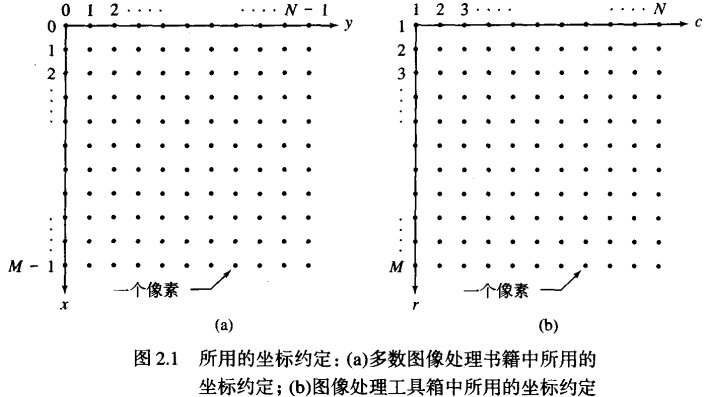
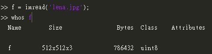
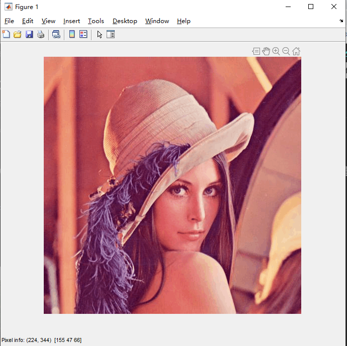
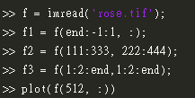
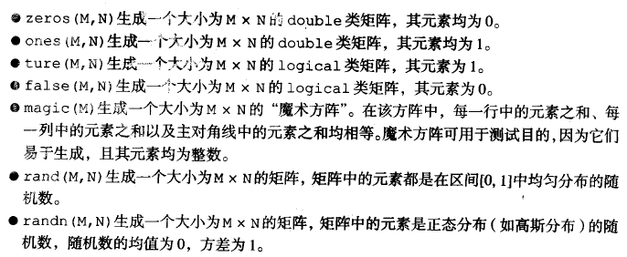

#第二章笔记 --- 基本原理
--------------------

##2.1数字图像的表示

图像可以被定义为二维函数 $f(x,y)$, $f$在任何坐标点处的振幅为图像在这个点的亮度。彩色图像可以看成是由多个二维图像组合而成：在RGB图像中，可以看做是3幅独立的分量图像组成的。

图像关于$x$,$y$和振幅连续，将图像转换成数字形式需要进行坐标化，坐标数字化的过程就是取样的过程，振幅数字化就是采样的过程；当$x$,$y$和振幅时有限且离散的时候，图像是数字图像。

###2.1.1坐标约定

在图像处理书籍中用的坐标是左上角是$(0,0)$;在图像处理工具箱中用的坐标是从$(1,1)$开始的，见下图。



###2.1.2图像的矩阵表示
一个$1xN$矩阵是行向量，一个$Mx1$矩阵是列向量

##2.2读取图像
使用imread将图像读入MATLAB环境。
```
imread('filename')
```
使用whos函数可以显示出一个数组的附加信息，比如：


##2.3显示图像
使用imshow进行显示，基本语法是```imshow(f,G)```,其中f是图像数组、G是图像的灰度级数，G默认级数是256。
```
imshow(f, [low  high])
```
函数会把所有小于或等于```low```的数值显示成黑色，所有大于或等于```high```的值显示为白色，介于两者之间的值以默认级数显示为中等亮度值.

```imshow(f, [ ])```可以将变量low设置为数组f的最小值，将变量high设置为数组f的最大值。【这样的显示方式常常适用于：动态范围较小的图像或者图像具有正负的情况】

交互查看图片像素值的函数是```impixelinfo```函数，已经不是书中说的```pixval```函数了，该函数已经过时！！！！具体效果见下图。


##2.4保存图像
```
imwrite(f, filename)
```

有一个常用但是只适用于JPEG图像的函数是
```imwrite(f,'filename.jpg','quality', q)```,其中q是一个介于0-100的数，q越小则图像退化越严重。

##2.5数据类
##2.6图像类型

- 亮度图像：一幅亮度图像是一个数据矩阵，其归一化的取值表示亮度。若亮度图像的像素都是uint8类或uint16类，则它们的整数值范围分别是田[0,255]和[0,65535]。若图像是double类，则像素的取值就是浮点数。规定双精度型归一化亮度图像的取值范围是[0,1]

- 二值图像

##2.7数据类与图像类型间的转换
##2.8数组索引
维数为1xN的数组称为行向量，计数从1开始（不从0开始）。使用转置运算符```.'```可将行向量转换为列向量。还有很多基本的操作这里就不再进行演示，后面会依次涉及到。

```linspace(a, b, n)```函数很重要,该语句产生一个含有n个元素的行向量X，这n个元素之间线性地隔开并且包含a与b

下面的例子将着重讲解索引的使用。


图片中的代码功能分别是，读取图片；将图片进行垂直翻转；将图片进行一个区域的提取；将图片进行二次取样；得到图片中的某一条水平扫描线。

###2.8.1选择数组的维数
使用```size（A）```获取矩阵的维数；使用```ndims(A)```获取图片的维数（尤其是对于多维图片，即彩色图片）

##2.9重要的标准数组



