#第三章笔记 --- 亮度变换与空间滤波
--------------------

##3.1背景知识

空间域指的是图像平面本身，在空间域内处理图像的方法是直接对图像的像素进行处理，表达式为$$g(x,y) = T[f(x,y)]$$，其中$T$是对图像进行的操作符，$g(x,y)$是输出图像，$f(x,y)$是输入图像。

##3.2亮度变换函数

由于亮度变换函数仅取决于亮度的值，而与$(x,y)$无关，所以亮度变换函数通常可写做如下所示的简单形式:
$$s=T(r)$$
其中，$r$表示图像$f$中相应点$(x,y)$的亮度，$s$表示图像8中相应点$(x,y)$的亮度。

###3.2.1函数imadjust

函数```imadjust```是对灰度图像进行亮度变换的基本IPT工具。语法为：
```
g = imadjust(f, [low_in  high_in], [low_out  high_out], gamma)
```
函数将对应区间的值进行映射，除图像f外，```imadjust```函数的输入输出值均指定在[0,1]之间。若f是uint8类图像，则函数```imadjust```将乘以255来确定应用中的实际值;若f是uintl6类图像，则函数```imadjust```将乘以65535。 参数gamma指定了曲线的形状，该曲线用来映射f的亮度值，以便生成图像g。若gamma小于1，则映射被加权至更高(更亮)的输出值，如图3.2(a)所示。若gamma大于1，则映射被加权至更低(更暗)的输出值。若省略了函数的参量，则gamma默认为1(线性映射)。
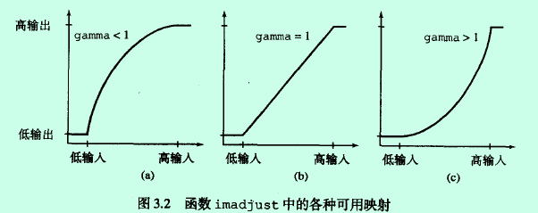

下面的代码使用```imadjust```对图片进行亮度变换：

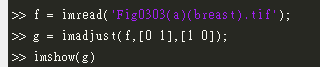
这种获得明暗反转图像的过程可用于增强嵌入在大片黑色区域中的白色或灰色细节，一幅图像的负片同样也可使用IPT函数```imcomplement```来得到。

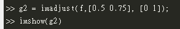
代码用于突出我们感兴趣的亮度带

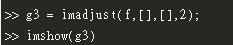
压缩灰度级的低端并扩展灰度级的高端【灰度值越大，像素点越亮】

###3.2.2对数和对比度拉伸变换

对数与对比度拉伸变换是进行动态范围处理的基本工具，对数变换通过下面的表达式实现：
$$g = c * log(1+ double(f))$$, where c is a constant,函数的形状类似于上面的第一幅图。

对数变换的主要应用是压缩动态范围。当执行一个对数变换时，通常期望将导致的压缩值还原为显示的全范围，对于8比特，可以使用下面的语句：
```
gs = im2uint8(mat2gray(g));
```


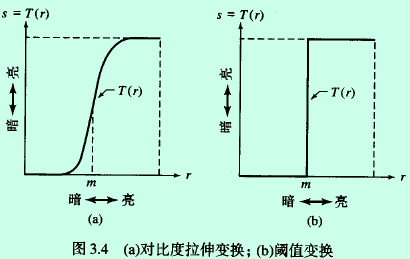
图3.4(a)所示的函数称为对比度拉伸变换函数，因为该函数可将输人值低于m的灰度级压缩为输出图像中较暗灰度级的较窄范围内;类似地，该函数可将输入值高于m的灰度级压缩为输出图像中较亮灰度级的较窄范围内输出的是一幅具有高对比度的图像。实际上，在图3.4(b)所示的限制条件下，输出是一幅二值图像。这种限制函数称为阂值函数，它是进行图像分割的一种有效工具。他的函数表示为：
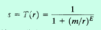

下面的例子是使用对数变换减小动态范围：
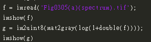
经过处理后的结果为：
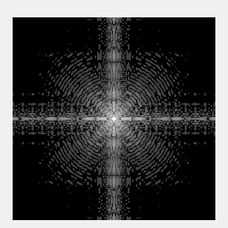

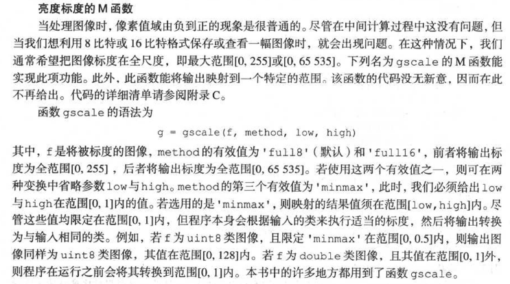


##3.3直方图处理与函数绘图
基于从图像亮度直方图中提取的信息的亮度变换函数，在诸如增强、压缩、分割、描述等方面的图像处理中扮演者基础性角色。

###3.3.1生成并绘制图像的直方图
一幅数字图像在范围[0,G]内总共有L个灰度级，其直方图定义为离散函数
$$h(r_k) = n_k$$
其中，$r_k$是区间[0, G]内的第k级亮度，$n_k$是灰度级为$r_k$的图像中的像素数。对于uint8类图像，G的值为255;对于uintl6类图像，G的值为65535;对于double类图像，G的值为1.0。MATLAB中的索引不能为0，故$r_1$相当于灰度级0 , $r_2$相当于灰度级1，如此等等，$r_L$相当于灰度级G。其中，uint8类图像或uint16类图像中$G=L-1$

用所有元素h(r_k)除以图像中的像素总数n得到归一化直方图
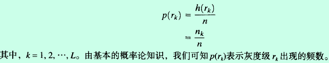

处理直方图的核心函数是```h = imhist(f,b)```,

其中，f为输入图像，h为其直方图$h(r_k)$, b是用于形成直方图的“收集箱”的个数(即灰度级的个数)。若b未包含在此变量中，则其默认值为256。一个“收集箱”仅仅是亮度标度范围的一小部分。例如，若我们要处理一幅uint8类图像并令b=2，则亮度标度范围被分成两部分:0至127和128至255。所得的直方图将有两个值:$h(1)$等于图像在区间[0, 127]内的像素总数，$h(2)$等于图像在区间[128, 255]内的像素总数。使用表达式```p=imhist(f,b)/numel(f)```就可简单地获得归一化直方图。函数numel(f)给出数组f中的元素个数(即图像中的像素数)。

书中详细解释了绘制直方图的函数和具体用法，这里就不再赘述了。

关于matlab的坐标需要再说一下：使用函数 ylim 和 xlim可以自动设定坐标轴的取值范围和刻度线。
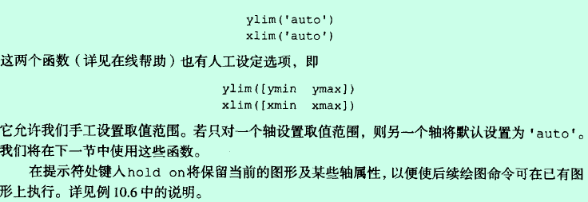

###3.3.2直方图均衡化
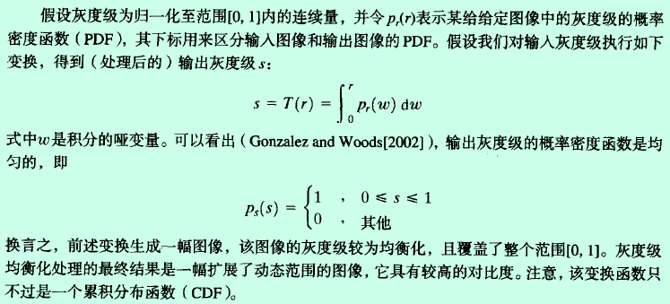
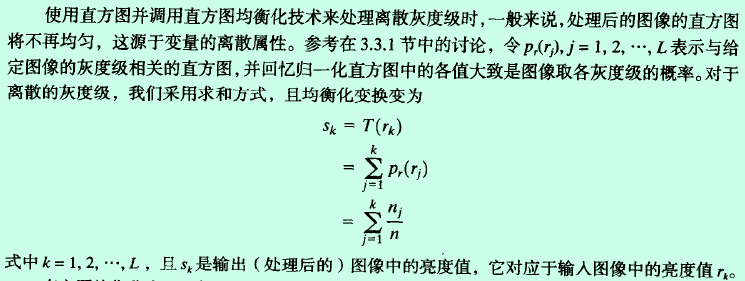

直方图均衡化由函数```histeq```实现，函数语法为：
```g=histeq(f, nlev)```
式中，f为输人图像，nlev是为输出图像指定的灰度级数。若nlev等于L(输入图像中可能的灰度级的总数)，则histeq直接执行变换函数$T(r_k)$。若nlev小于L，则histeq试图划分灰度级，以便能够得到较为平坦的直方图。与函数imhist不同，histeq中的默认值为nlev=64。一般来说，我们将nlev赋值为灰度级的最大可能数量(通常为256)，因为这样能够利用刚才描述的直方图均衡化方法得到较为正确的执行结果。

###3.3.3直方图匹配（规定化）
生成具有指定直方图的图像的方法称为直方图匹配或直方图规定化
具体案例分析详见书本【数学原理这部分没有太明白】，需要再看。

##3.4空间滤波
若对邻域中像素的计算为线性运算时，则此运算称为线性空间滤波(也称为空间卷积);否则，我们称此运算为非线性空间滤波。


